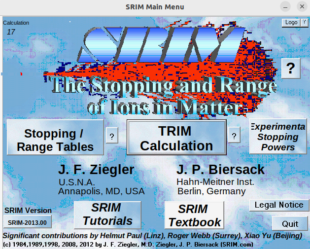

# Getting Started

MIGDAL_simulator is a python-based simulation framework. Here we will detail the setup of each component. If you run into any issues with the steps below please contact Jeff Schueler (schuel93@gmail.com) and describe your issue. **Note:** If you are using Windows, we recommend using MIGDAL_simulator with [WSL2](https://learn.microsoft.com/en-us/windows/wsl/install).

## (I) Install the required python packages

We recommend setting up a fresh python environment, however this isn't strictly necessary. The following packages need to be installed in your python environment (all are available with `pip`):

- numpy (not tested with the new (as of 2024) numpy 2.x.x, so I would highly recommend installing numpy < 2.0.0)
- pandas
- pyarrow (for reading and writing .feather files)
- scipy
- numba
- pandas
- matplotlib
- tqdm
- pyyaml
- ruamel
- jupyter

## (II) Clone the [MIGDAL_simulator git repository](https://github.com/jschuel/MIGDAL_simulator)

Clone via ssh with

```sh
git clone git@github.com:jschuel/MIGDAL_simulator.git
```

or, if you don't have an ssh keypair set up on your github account, you can clone via https with

```sh
git clone https://github.com/jschuel/MIGDAL_simulator.git
```

## (III) Installing Degrad

Degrad is a FORTRAN program that simulates the transport of electrons in gas mixtures. Installing and compiling Degrad is required in order to generate primary electronic recoils. **Note:** We have tested this only on Ubunutu 22.04.

1. Navigate to the `MIGDAL_simulator/` directory and download the Degrad fortran file

```sh
wget https://degrad.web.cern.ch/degrad/degrad-3.19.f
```

2. Install the GFortran compiler. Instructions for how to do so vary depending on operating system. Please consult the [GFortran installation guide](https://fortran-lang.org/learn/os_setup/install_gfortran/) for how to do this on your machine.

3. In the `MIGDAL_simulator/` dircetory, compile degrad using GFortran

```sh
gfortran degrad-3.19.f -o degrad
```

this will an executable called `degrad`. MIGDAL_simulator runs the `degrad` executable with python steering scripts.

## (IV) [Optional] Install SRIM and RCTRIM

SRIM is an closed source but free 32-bit Windows program. RCTRIM is a private git repository that interacts with TRIM outputs to form 3D ionization distributions of nuclear recoils in a user-defined medium. These ionization distributions are inputs to MIGDAL_simulator. If you are a part of the MIGDAL collaboration, please contact Jeff Schueler (schuel93@gmail.com) to request access to RCTRIM. 

### SRIM installation (Mac OS/Linux)
1. Install wine `brew install --cask wine-stable` (Mac), `sudo apt-get install wine-stable` (Debian-based linux distros like Ubuntu), `yum install wine-stable` (Redhat-based distros). **Note:** There may be some configuration steps in Wine before you're able to run SRIM/TRIM. You can configure wine by typing winecfg` in your terminal.

2. In the MIGDAL_Simulator directory, run

```sh
source install_srim.sh
```

this script will prompt you to enter the directory you want to install SRIM in and will then download the SRIM executable, move it to the target directory, and run the install executable using `wine`.

3. Navigate to the directory you installed SRIM in and then `cd SRIM-Setup`. The Srim-Setup directory contains several `.ocx` files. You will need to register these into your build of `wine` by typing in

```sh
wine regsvr32 <file_name>.ocx
```

do this for each of the `.ocx` files in this directory. For example, for the file called `ComCtl32.ocx`, you'll type `wine regsvr32 ComCtl32.ocx`

4. Try running by navigating to the directory you installed SRIM in and then running

```sh
wine SRIM.exe
```

If a window like below pops up, you've successfully installed SRIM. If not, I would recommend consulting Google or ChatGPT to help troubleshoot your installation.



### SRIM installation (Windows)
SRIM is a native Windows application so please consult the [Official SRIM website](http://srim.org/) for installation instructions.

### Installing RCTRIM
Once you have access, navigate to `MIGDAL_simulator` and clone the repository in this directory.