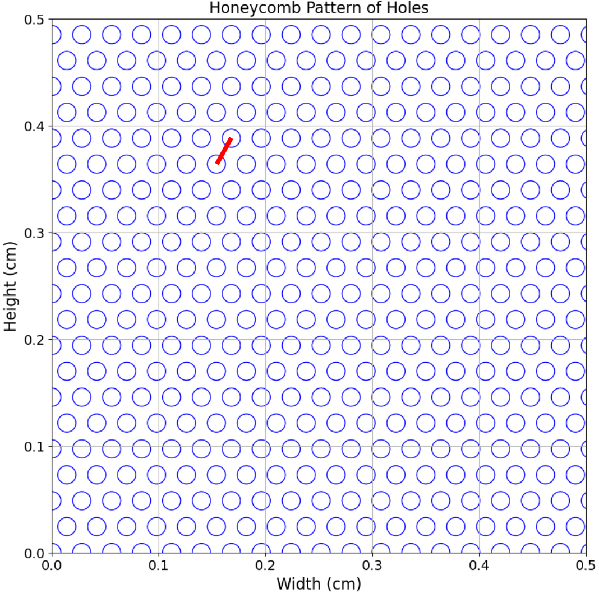

# MIGDAL Detector Simulation

In the previous section of this guide, we mentioned that at the highest level, the workflow of this package can be broken down into:

1. Simulate primary tracks

2. Process these tracks with `process_primary_tracks.py`

The previous section detailed step (1), this section details step (2). In particular, this section details the settings in `configuration.yaml` for running `process_primary_tracks.py`, the core script of our MIGDAL detector simulation, as well as the simulation steps performed by this script.

## Relevant configuration.yaml parameters

1. Under the `Gas_props` heading, there are several configurable diffusion parameters. The default values (those present in the main branch of the MIGDAL_simulator git repository) of these parameters were computed with Magboltz and assume 50 Torr CF4 gas with drift fields of 200V/cm, transfer gap fields of 600V/cm, and induction gap fields of 400 V/cm:

- **vd** - drift speed of ionization in the the drift volume. **This setting isn't explicitly used in the simulation at this time**

- **W** - Work function of the gas in eV. This is used to compute the ionization energy of primary tracks

- **sigmaT** - Transverse diffusion coefficient (in um/sqrt(cm)) in the drift volume

- **sigmaL** - Longitudinal diffusion coefficient (in um/sqrt(cm)) in the drift volume

- **sigmaT_trans** - Transverse diffusion coefficient (in um/sqrt(cm)) in the transfer gap

- **sigmaL_trans** - Longitudinal diffusion coefficient (in um/sqrt(cm)) in the transfer gap

- **sigmaT_induc** - Transverse diffusion coefficient (in um/sqrt(cm)) in the induction gap

- **sigmaL_induc** - Longitudinal diffusion coefficient (in um/sqrt(cm)) in the induction gap

2. Under the `TPC_sim` heading:

- **nGEM** - Number of GEMs to simulate. Any number of GEMs is now supported, however, the current version of this software only supports a single value for `sigmaT_trans` and `sigmaL_trans` that is applied to all GEMs. Similarly the value set for `transfer_gap_length` is the same for each transfer gap if `nGEM` > 2. 

- **gain** - Gain amplification factor across all GEMs. This is computed as gain**(1/nGEM). Note that the *effective* gain will be significantly less than the value set for `gain` because of losses between GEM holes.

- **GEM_width** - Width of the GEM (x) in cm

- **GEM_height** - Width of the GEM (y) in cm

- **GEM_thickness** - Thickness of GEM (z) in cm

- **hole_diameter** - Diameter of each GEM hole (um)

- **hole_pitch** - Center-to-center spacing (in um) between nearest-neighboring GEM holes. The red line in the figure below designates this spacing:



Currently MIGDAL_simulator only suports GEMs with honeycomb-patterns of holes

- **drift_gap_length** - Length of the drift region in cm

- **transfer_gap_length** - Length of all transfer gaps in cm

- **induction_gap_length** - Relevant when simulating ITO output. This is the length of the gap between the last GEM and the anode in cm.

- **extra_GEM_diffusion** - Additional smearing after each GEM to produce track images that look more similar to real data. The default setting of 0.01425 corresponds to the default GEM_thickness / 4.

- **min_drift_length** - Minimum length (cm) to drift and diffuse a track through the drift gap. **Track drift is simulated as a random uniform distribution between the minimum and maximum specified drift lengths**

- **max_drift_length** - Maximum length (cm) to drift and diffuse a track through the drift gap

- **GEM_offsetsx** - List of GEM hole offsets in x (in um). List entries be entered as intengers or floats. For 3 GEMs w/ 280um pitch [0,0,0] is max aligned and [0,140,0] is max misaligned, where maximum misalignment in x is GEM_pitch/2

- **GEM_offsetsy** - List of GEM offsets in y. Offsets are relative to the first GEM, so [0,80.829,0] means GEM 1 and 3 are aligned with eachother but GEM 2 is maximally misaligned, where maximum misalignment in y is sqrt(3)*pitch/6. With the maximum x offset, this puts the second GEM hole in the middle of the equilateral triangle formed by three of the first GEM's holes.

- **cam_bins_x** - Number of x-bins to digitize the camera readout to. 2048 is the standard number for 2x2-binned ORCA quest data (configuration used in the MIGDAL experiment)

- **cam_bins_y** - Number of y-bins to digitize the camera readout to. 1152 is the standard number for 2x2-binned ORCA quest data (configuration used in the MIGDAL experiment)

- **cam_width** - Width (x) of the field of view of the camera readout in cm. In MIGDAL this value is 8cm

- **cam_height** - Height (y) of the field of view of the camera readout in cm. In MIGDAL this value is 4.5cm

3. Under the `Sim_settings` heading:

- **randomize_position** - Set to True to randomize the (x,y) position of primary tracks. Otherwise primary tracks are in the center of the readout (cam_bins_x//2, cam_bins_y//2)

- **digitization_input_file** - Filepath to the `.feather` file of primary tracks to be simulated in the MIGDAL detector. See [the previous section of these documents](https://migdal-simulator.readthedocs.io/en/latest/Simulating%20Primary%20Tracks.html) for instructions of how to generate this.

- **apply_drift** - If True, drift and apply diffusion to primary ionization distributions through the Migdal detector

- **apply amplification** - If True, apply GEM amplification

- **gpu** - We've built in minimal GPU compatibility. Recommend setting this to False, but if True, `process_primary_tracks.py` will simulate amplification on a CUDA-supported GPU

- **digitize** - If True, bin the GEM-amplified signal and simulate the CMOS camera and ITO strip readout responses to this signal

- **write_ITO** - The ITO simulation is just a crude binning in xz. Given that there is no signal response simulation, we recommend setting this to False.

- **write_gain** - If True, save the coordinates of each individual GEM-amplified ionization point. **Highly recommend setting this to False to save diskspace**

- **overwrite_output** - If True, when `process_primary_tracks.py` is run, the primary track file is overwritten by the output of this script. The primary track information from the output will remain the same if this is marked True, so this setting simply replaces the primary track file with the file containing the primary track information *and* the MIGDAL detector simulation information

- **output_dir** - If the `overwrite_input` setting above is set to False, then this is the directory that the output of `process_primary_tracks.py` will be placed in

## The detector simulation

After inputting the desired settings into `configuration.yaml`, we can perform the detector simulation by simply running `python3  process_primary_tracks.py`.

Here are descriptions of what this script does:

### 1. Apply drift and diffusion through the MIGDAL TPC drift volume

The length over which a track is drifted and diffused (within the drift volume before the GEMs) is simulated as a random uniform distribution between `min_drift_length` and `max_drift_length` (both specified in the `TPC_sim` heading of `configuration.yaml`). We specify drift in this script as follows:

```python3
# define drift length range
self.data['drift_length'] = np.random.uniform(min_drift_length,max_drift_length,len(self.data)) #cm
# Center the z (drift) distribution of ionization
self.data['z'] = self.data['z'].apply(lambda x: x-x.mean())
# Redefine absolute z by adding the assigned drift length of the track to the centered z-distribution of ionization
self.data['z'] = self.data['drift_length']+self.data['z']
```

As you can see, the drift length is currently defined as the drift distance of the *center* (in z) of the track. If you want to change this to be, say, the distance of the ionization point closest to the GEM, you'll need to look through the source code and change `self.data['z'] = self.data['z'].apply(lambda x: x-x.mean())` to `self.data['z'] = self.data['z'].apply(lambda x: x-x.min())`.

Diffusion is applied assuming random Gaussian smearing of `x`, `y`, and `z` with a mean of 0 and a sigma of the product of the square root of the drift length of each ionization point (`self.data['z']` in the code block above) and the appropriate diffusion coefficient (transverse diffusion coefficient for `x` and `y`, and longitudinal for `z`). For each (x,y,z) triplet, the Gaussian smearing is drawn separately for `x`, `y`, and `z` (meaning a different smearing factor is used for each coordinate).

### 2. Identify the ionization points passing through GEM 1

GEM 1 has a honeycomb pattern of holes (see figure above) and is centered at (x=0,y=0). After applying diffusion over the drift length, the code checks the (x,y) coordinates of each ionization electron and uses a k-d tree to determine which points align with a GEM hole opening. Those that do are saved, and those that don't are discarded. **For Migdal tracks**: The `ID` of each ionization electron (0 = nuclear recoil, 1 = electron recoil) is still kept track of here.

### 3. Apply amplification from GEM 1

Each ionization electron passing through a GEM hole is amplified by random exponential distribution with a scale parameter equal to the square root of the `gain` specified in `configuration.yaml`. Diffusion is applied to each amplified ionization point assuming the length of the transfer gap as specified in `configuration.yaml`, and the transverse and longitudinal coefficients through the transfer gap (`sigmaT_trans` and `sigmaL_trans`). We apply an additional diffusion over a "fudge factor" length of 1/3 of the GEM_thickness. This extra diffusion needs to be validated by comparing simulation outputs to real data, so this "fudge factor: will likely change. **For Migdal tracks**: The `ID` of each amplified ionization point is assigned to match the `ID` of its parent non-amplified ionization point.

### 4. Identify the ionization points passing through GEM 2

Like GEM 1, GEM 2 also has a honeycomb pattern of holes. GEM 2 by default is also centered at (x=0,y=0), however the user may offset GEM 2 in both `x` and `y` with respect to GEM 1 with the `GEM2_offsetx` and `GEM2_offsety` parameters in `configuration.yaml`. Like before, we use a k-d tree to determine which amplified ionization points align with a GEM hole opening in GEM 2. Those that do are kept, those that don't are discarded. **For Migdal tracks**: The `ID` of each ionization electron (0 = nuclear recoil, 1 = electron recoil) is still kept track of here.

### 5. Apply amplification from GEM 2

We apply the same procedure as step (3) above, *except* for diffusion, we only diffuse using the "fudge factor" length of 1/3 the GEM thickness.

### 6. Simulate the CMOS camera readout

We digitize the post-GEM-2-amplified light by binning the GEM 2-output ionization to an 8cm x 4.5cm grid of 2048 x 1152 pixels centered at (x=0,y=0). In the MIGDAL experiment, the optical readout catches the scintillation light from GEM 2 as its amplified, therefore we don't apply any diffusion past GEM 2 to the camera signal. **For Migdal tracks**: We separately bin ionization coming from the parent ER and parent NR. This allows us to compute the fractional pixel content corresponding to the ER, thereby providing a measure of how significant a read out pixel is in terms of its ER-content.

### 7. Diffuse the GEM 2-amplified signal over the induction gap

The ITO readout is on the anode, therefore the ionization distribution undergoes additional diffusion through the length of the induction gap before being deposited onto the ITO strips. We use the `sigmaT_induc` and `sigmaL_induc` coefficients when simulating this diffusion.

### 8. Simulate the ITO readout

Here we only apply binning to the dimensions of the ITO strips and do not-simulate any of the physics of producing an ITO signal. We therefore bin the post-GEM-2-ionization after diffusing through the induction gap in (x,z) into a grid of 120 strips (x) by 150 samples (z) spaced between -5cm and +5cm in x, and 0 and 3.9cm in y. This binning ensures we capture the absolute z of each track, and also uses the same bin-cell size as real ITO data.

## Detector simulation output

In addition to the variables written to the original primary track files (listed [here](https://migdal-simulator.readthedocs.io/en/latest/Simulating%20Primary%20Tracks.html#primary-track-output-variables)) , the following additional variables are written to the processed MIGDAL detector simulation output:

* **drift_length** - Distance in cm between the center of the primary track and GEM 1

* **{x,y,z}_diff** - Coordinates of primary track after applying diffusion and before amplification

* **{x,y,z}_amp** - Coordinates of primary track points that pass through a hole of GEM 1

* **ID_amp** (*Migdal files only*) - Identity (0 = ER, 1 = NR) of each ionization deposit passing through the hole of GEM 1.

* **{x,y,q}_cam** - Coordinates and number of electrons present in each simulated CMOS camera pixel. These are stored as sparse arrays to save space.

* **ER_frac_cam** (*Migdal files only*) - The fraction of intensity in each (x,y) camera pixel belonging to the truth ER portion of the primary track.

* **{x,z,q}_ITO** - Coordinates and number of electrons present in each simulated ITO pixel. These are stored as sparse arrays to save space.

* **ER_frac_ITO** (*Migdal files only*) - The fraction of intensity in each (x,z) ITO pixel belonging to the truth ER portion of the primary track.