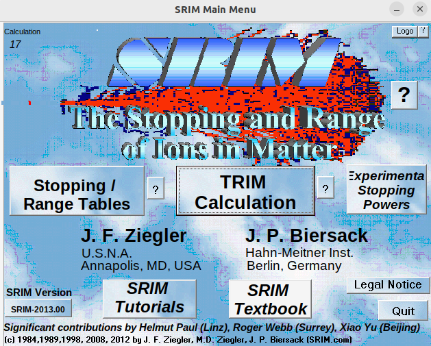

# Simulating Primary Tracks
This is a guide detailing how to simulate primary tracks with MIGDAL_simulator. At the highest level, the workflow of this package can be broken down into two steps:

1. Simulate primary tracks

2. Process these tracks with `process_primary_tracks.py`

This guide details step (1). Step (1) provides primary electronic recoils (ERs), nuclear recoils (NRs), and Migdal effect tracks (Migdals). These are the inputs to step (2) which the simulation of these primary tracks inthe MIGDAL detector. Details of step (2) are provided in the [MIGDAL Detector Simulation](https://migdal-simulator.readthedocs.io/en/latest/MIGDAL%20Detector%20Simulation.html) section of these documents.

## Simulating ERs with Degrad

If you have not yet compiled Degrad on your machine, please work through the [Getting Started](https://migdal-simulator.readthedocs.io/en/latest/Getting%20Started.html) section of these documents.

Nearly all of MIGDAL_Simulator's functionality is configurable with `configuration.yaml`. Currently, `configuration.yaml` only supports simulating ERs in 50 Torr CF4 gas. We hope to update this soon.

Below are the `configuration.yaml` parameters specifically relevant to primary ER track generation. Unless otherwise noted, these parameters are found under the `Degrad_settings` heading:

- **input_file** - The filepath of Degrad's input card file. The `input.card` default values don't need to be manually adjusted

- **n_tracks** - The number of primary tracks to simulate

- **seed** - The pseudorandom number generator seed input into Degrad. If you run degrad parallely, it doesn't matter what you put in here; the seed will be set by `run_degrad.py`

- **energy** - Recoil energy of the primary track ERs **in eV**

- **primary_track_output_dir** - directory you want Degrad primary tracks output file to be saved to

- **randomize_primary_track_order** (under the `Sim_settings` header) - If True, this will shuffle the order of produced tracks. This does not have any effects on the tracks themselves, just where they show up in the output dataframe.

- **rotate_tracks** (under the `Sim_settings` header) - If true, this "isotropizes" the angular distribution of primary tracks. If false, all tracks will point in the +x direction

- **parallel** - Setting this to True splits the Degrad processing into chunks and then concatenates the output. For instance if we're generating 5000 electrons and we set parallel to True and then parallel chunks (below) to 500. This will run 500 instances (each with different pseudorandom seeds) each generating 10 ERs. The 500 output file-chunks will then be concatenated into a single file and the file-chunks will then be deleted.

- **parallel_chunks** - See previous parameter

Once you have specified all of your parameters in `configuration.yaml`, there are three scripts you can run:

### Script 1: run_degrad.py

Run this script with `python3 run_degrad.py`. This script will generate tracks following the specifications you put in `configuration.yaml`. The output file will be placed in the `primary_track_output_dir` as specified in `configuration.yaml`. **This is the recommended script to use when you're producing a monoenergetic sample of ER primary tracks.**

### Script 2: run_degrad_multiple_energies.py

This is a script that runs `run_degrad.py` multiple times as a subprocess. The script still inherits everything from `configuration.yaml`, however it can also modify the `'n_tracks'`, `'energy'` and `'parallel_chunks'` field of `configuration.yaml`. As currently written, the script is meant to loop over a list of energies and generate ERs over that energy range. **The recommended usage of this script is therefore to generate ERs at user-defined energy steps**. Changing the energy range of this script is **not** supported by `configuration.yaml`, so to update this, you'll have to open `run_degrad_multiple_energies.py` in your favorite text editor and modify the information shown in the code block below.

```python
if __name__ == "__main__":
    yaml_file_path = 'configuration.yaml'
    processing_script_path = 'run_degrad.py'

    # Modify these values as needed
    n_tracks = 400
    energies = [200 * i for i in range(10, 61)]  #These are in eV so this range is 1-12 keV
    parallel_chunks = 1

    for e in energies:
        read_and_modify_yaml(yaml_file_path, n_tracks, e, parallel_chunks)
        run_processing_script(processing_script_path)
```

The specific information to update is `n_tracks`, `energy` and `parallel_chunks`, though I've found this script to run fastest when using 1 parallel_chunk (i.e. not splitting Degrad into sub-subprocesses).

Once you've configured everything you can run this script with `python3 run_degrad_multiple_energies.py`.

As currently written, this script doesn't combine the output primary track files. If the primary track files generated from this script are the only files in their directory, you can use something like the code block below to easily combine them

```python
import pandas as pd
import os

#Combined dataframe
combined = pd.concat([pd.read_feather(fi) for fi in sorted(os.listdir())])
combined = combined.sample(frac=1) #shuffle the order of the tracks
combined.index = [i for i in range(0,len(combined))] #reset the indices
#save
combined.to_feather("combined_output.feather") #chage to whatever name you want
```
## Simulating NRs with SRIM
**Note:** RCTRIM is required to generate primary NR track output files
Here we will walk through the steps of simulating NRs using SRIM/TRIM. The examples we use are relevant for generating simulation for the MIGDAL experiment which produces nuclear recoils from DD-generator neutrons. Assuming a monoenergetic source of ~2.5 MeV neutrons, the peak Fluorine and Carbon recoil energies from elastic scattering are around 468 keV and 699 keV, respectively.

RCTRIM process the 3D ionization distributions of tracks generated by SRIM/TRIM and also "snips" them appropriately to match user-defined energies. We therefore recommend generating recoils in SRIM/TRIM that are slightly higher energy than the Fluorine and Carbon recoil endpoints. This way any recoil energy that falls within the DD-neutron induced C and F recoil spectrum can be extracted from the initial sample of events simulated by SRIM/TRIM.

**Currently RCTRIM only supports processing recoils in CF4 gas. It also only works if you have SRIM/TRIM output samples for both C and F recoils together. Below is the recommended procedure to follow for creating and processing NR primary tracks:**

1. Fill out your desired configuration in the `RCTRIM_settings` heading of `configuration.yaml`. **Some notes**:

a. If you're using Linux or Mac OS, `SRIM_output_dir` will likely be `path_to_your_SRIM_installation/'SRIM Output'`. Make sure you set this correctly, as the RCTRIM scripts will try to move files from this directory.

b. Make sure you specify either C or F for `recoil_species_generated`

c. `base_dir` can be whatever you want, but `C_recoil_dir` and `F_recoil_dir` must be formatted as explained in the comment in `configuration.yaml`. These directories will be automatically generated by the RCTRIM scripts. `output_dir` will also be created and can therefore be whatever you want.

d. `N_recoils` can be more than the number of tracks you simulate in SRIM/TRIM.

2. Open up SRIM. On Windows, you should be able to just click the application icon. On Linux/Mac OS, you'll need to navigate to your SRIM installation directory and then type `wine SRIM.exe` in your terminal. A window like below should pop up. 



Click the TRIM Calculation button and the window below should pop up:


Change the settings of this window to match the desired settings for the `recoil_species_generated` you input in `configuration.yaml` (C or F). An example of a properly filled form for simulating F recoils is shown below (C is analogous but use a different energy as described below):


Here are the changes we made for this window:

- Element was changed from **H** to **F**

- Energy was changed from 10 keV to 500 keV. **Note**: when simulating F recoils I use 500 keV, and when simulating C recoils I use 720 keV

- Target Layer 1 name was changed to CF4, its width changed to 100mm, Density to 0.00024 g/cm3, compound correction changed to 0.9585m and the Gas button was checked. **Note:** The density shown in the figure is wrong. Sometimes I find the density automatically changes to this value, make sure to change it back to 0.00024 g/cm3 before initializing TRIM.

- We added Carbon and Fluorine as Input Elements to Layer. We simply add the name of the first element (carbon), and then click the "Add New Element to Layer" button, and select Fluorine for that. For Fluorine we set "Atom Stoich" to 4 (because CF4).

- Under Special Parameters, I changed the Total Number of Ions to from 99999 to 10000

- Under Output Disk Files, check the "Collision Details" box. A popup window will show up. Click No.

-In the text box below this called Special "EXYZ File" Increment (eV), set this to 1

3. Click the green "Save Input & Run TRIM" button. The popup window below will open:


Uncheck the checked box in the COLLISION PLOTS section in the left banner. Doing this will **greatly** speed up TRIM's calculations.

4. After TRIM is finished, double check that the recoils you generated in TRIM are the same species as `recoil_species_generated` in `configuration.yaml`. If they aren't change this field in `configuration.yaml` to the appropriate recoil species.

5. Navigate to the `RCTRIM` directory and run `python3 move_SRIM_output_to_working_directory.py`

6. Repeat steps 1-5 for the other recoil species. Note: The `base_dir`, `C_recoil_dir`, and `F_recoil_dir` fields should be the same here as for step (1).

7. Now `C_recoil_dir`, and `F_recoil_dir` should each have `COLLISON.txt` and `EXYZ.txt` output files from TRIM. Verify this is the case.

8. In the RCTRIM directory, run `python3 create_recoils.py`. This will create an NR primary tracks file consisting of `N_recoils` of `recoil_species_generated` that will be written to `output_dir` as specified in the `RCTRIM_settings` heading of `configuration.yaml`. The energy distribution of these recoils should follow the expected recoil energy spectrum induced by elastic scattering of 2.5 MeV DD-induced neutrons.

9. Re-do step 8 for the other recoil_species if you would like.

## Generating Migdal primary tracks

You can generate simulated Migdals (ER and NR primary tracks stitched at their vertices) by adjusting the subfields of the `Migdal_sim` header in `configuration.yaml` and then running

```sh
python3 create_migdals.py
```

## Primary track output variables

Below are descriptions of each column of the output primary track dataframes produced. The {ER,NR}_ prefixes are only attached in the Migdal primary track outputs:

- **{ER,NR}_nHits** - Number of primary ionization electrons of the track
- **{ER,NR}_truthE** - Truth energy (keV) of each recoil
- **{ER,NR}_ionizationE** - Energy after quenching (computed as nHits * 34.2 eV)
- **{ER,NR}_truth_dir** - Unit 3-vector of true recoil direction. Can compute the angle between the ER and NR using the dot product
- **{ER,NR}_truth_{𝜃,𝜙}** - Zenith (w.r.t. z) and azimuthal (w.r.t. x) angles of truth vectors
- **x,y,z** - Coordinates of primary track ionization
- **ID** (*Migdal files only*) - Identity (0 = ER, 1 = NR) of each ionization deposit. Filtering on this column can isolate the ER and NR ionization distributions
- **t** (*ER files only*) - Relative time-occurence of the ionization deposit. All ionization points are time ordered, so the 0th entry of (x,y,z,t) is the vertex of the track. NR primary tracks are also time-ordered in this way, but the time is not stored as a variable
- **flag** (*ER files only*) - Flag for process producing ionization point (1 = fluorescence, 2 = pair production, 3 = bremsstrahlung, 0 = otherwise)
- **species** (*NR files only*) - Specifies whether the track is an F or C recoil. For Migdal files, the recoil type will be in the file name, but this should probably be added as a column if we end up producing mixed primary track files containing F and C recoils.