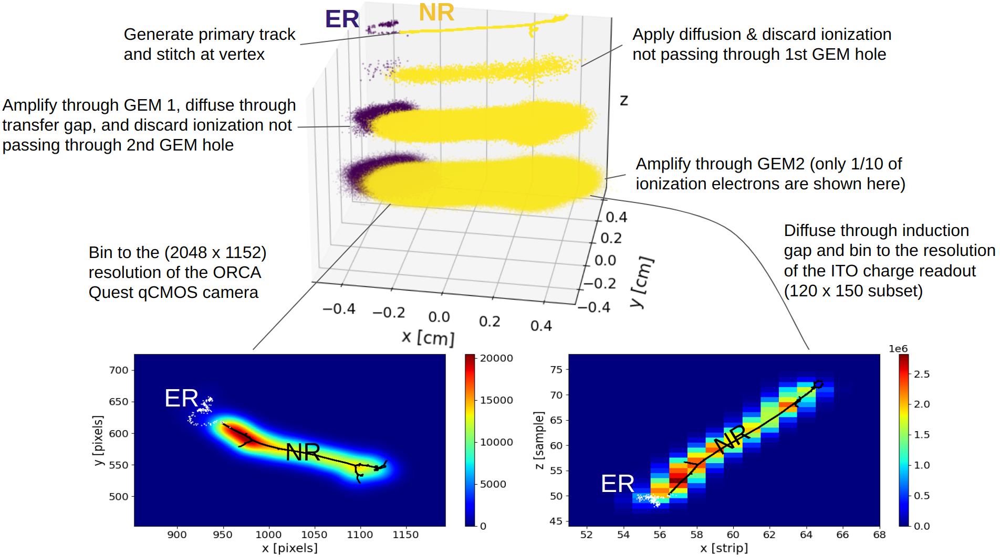

Welcome to MIGDAL_simulator's documentation!
===================================

.. toctree::
   :maxdepth: 2
   :caption: Contents:

   Getting Started
   Simulating Primary Tracks
   MIGDAL Detector Simulation

MIGDAL_simulator v1.0
===============

MIGDAL_simulator is an end-to-end simulation framework for the MIGDAL experiment. The simulator integrates with `Degrad <https://degrad.web.cern.ch/degrad/>`__ to generate primary electron recoil ionization distributions, and RCTRIM (private repository) to generate primary nuclear recoil ionization distributions. The simulator can then stitch together primary electronic and nuclear recoil tracks at their vertices to form primary ionization distributions for the Migdal effect. These primary tracks can then be passed through a single script that is configurable by a flexible ``configuration.yaml`` file. The script simulates:

1. Drift with diffusion
2. GEMs with user-specified hole size and pitch (assumes a honeycomb pattern of holes)
3. GEM amplification
4. Transfer gap diffusion
5. Optical readout after the second GEM
6. Induction gap diffusion
7. Charge readout after amplified charge is drifted through the induction gap

This series of documents details installation, configuration, and all functionality that currently exists within this simulation framework.

